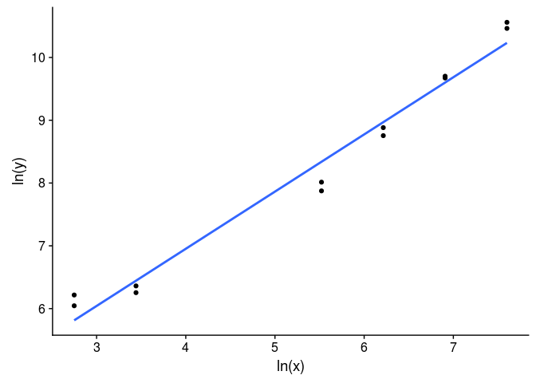
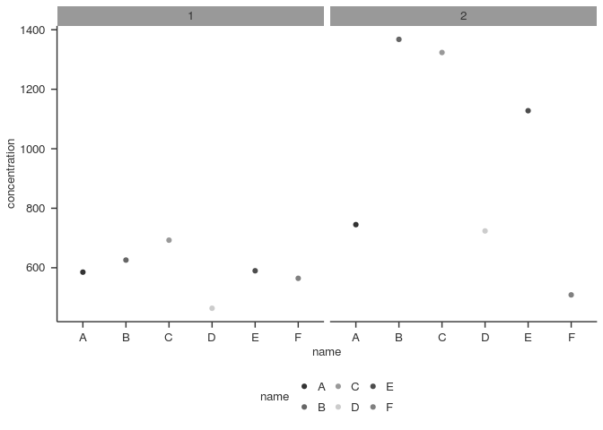
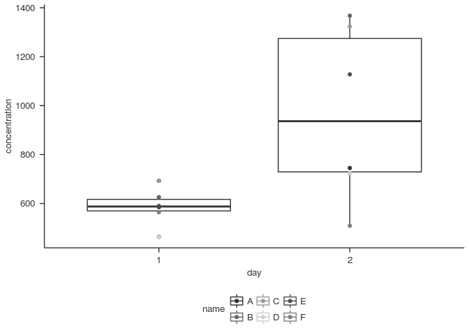

<!-- README.md is generated from README.Rmd. Please edit that file -->
    ## Loading tidyverse: ggplot2
    ## Loading tidyverse: tibble
    ## Loading tidyverse: tidyr
    ## Loading tidyverse: readr
    ## Loading tidyverse: purrr
    ## Loading tidyverse: dplyr

    ## Conflicts with tidy packages ----------------------------------------------

    ## filter(): dplyr, stats
    ## lag():    dplyr, stats

eenv
====

A package to load packages, functions and variables I frequently use.

Installation
------------

You can install `eenv` from github with:

``` r
# install.packages("devtools")
devtools::install_github("randomchars42/eenv")
```

Loading
-------

``` r
library("eenv")
```

Data import
-----------

### Preparing your raw data

Suppose you have an `ods` / `xls(x)` file with raw values obtained from a measurement like this:

\`\`\`{r, echo = FALSE}f data &lt;- readr::read\_csv2( system.file("extdata", "values.csv", package = "eenv"), col\_names = FALSE) rownames(data) &lt;- LETTERS\[1:6\]

knitr::kable( data, row.names = TRUE, col.names = as.character(1:6))


    Save them as `plate_1.csv`- thats like an `ods` / `xls(x)` file but its basically a text file with the values separated by commas (or semicolons for languages that use "," to separate decimals).

    In the current versions of LibreOffice / OpenOffice / Microsoft office theres an option "Save as" > "csv".

    ### Adding names

    Before feeding your samples into your measuring device you most likely drafted some sort of plan which position corresponds to which sample (didn't you?). It may have looked like this:

&gt; Using ',' as decimal and '.' as grouping mark. Use read\_delim() for more control.
=======================================================================================

&gt; Parsed with column specification:
======================================

&gt; cols(
==========

&gt; X1 = col\_character(),
===========================

&gt; X2 = col\_character(),
===========================

&gt; X3 = col\_character(),
===========================

&gt; X4 = col\_character(),
===========================

&gt; X5 = col\_character(),
===========================

&gt; X6 = col\_character()
==========================

&gt; )
======

&gt; Warning: Setting row names on a tibble is deprecated.
==========================================================


         1      2      3    4    5    6  
    ---  -----  -----  ---  ---  ---  ---
    A    CAL2   CAL2   A    A    H    H  
    B    CAL3   CAL3   B    B    I    I  
    C    CAL4   CAL4   C    C    J    J  
    D    CAL5   CAL5   D    D    K    K  
    E    CAL8   CAL8   E    E    L    L  
    F    CAL9   CAL9   F    F    M    M  

    So you had some calibrators (CAL1 - CAL4) and samples A, B, C, D, E, F, H, I, J, K, L, M each in duplicates.

    To easily set the names for your samples just copy the names into your new `plate_1.csv`:

&gt; Using ',' as decimal and '.' as grouping mark. Use read\_delim() for more control.
=======================================================================================

&gt; Parsed with column specification:
======================================

&gt; cols(
==========

&gt; X1 = col\_character(),
===========================

&gt; X2 = col\_character(),
===========================

&gt; X3 = col\_character(),
===========================

&gt; X4 = col\_character(),
===========================

&gt; X5 = col\_character(),
===========================

&gt; X6 = col\_character()
==========================

&gt; )
======

&gt; Warning: Setting row names on a tibble is deprecated.
==========================================================


         1       2       3     4     5      6    
    ---  ------  ------  ----  ----  -----  -----
    A    34997   38550   638   599   736    805  
    B    16341   15879   648   667   1335   1345 
    C    7204    6340    667   775   1276   1325 
    D    3023    2630    491   510   726    775  
    E    579     520     618   628   1188   1060 
    F    501     422     589   608   520    569  
    G    CAL2    CAL2    A     A     H      H    
    H    CAL3    CAL3    B     B     I      I    
    I    CAL4    CAL4    C     C     J      J    
    J    CAL5    CAL5    D     D     K      K    
    K    CAL8    CAL8    E     E     L      L    
    L    CAL9    CAL9    F     F     M      M    

    Tell `sets_read()` your data contains the names and which column should hold those names by setting `additional_vars = c("name")`.


    It does not matter which name you select for the column. Pick anything that adequately describes the data in the column.

    ### Adding more information

    Suppose samples A, B, C, D, E, F were taken at day 1 and H, I, J, K, L, M were taken from the same rats / individuals / patients on day 2.

    It would be more elegant to encode that into the data:

&gt; Using ',' as decimal and '.' as grouping mark. Use read\_delim() for more control.
=======================================================================================

&gt; Parsed with column specification:
======================================

&gt; cols(
==========

&gt; X1 = col\_character(),
===========================

&gt; X2 = col\_character(),
===========================

&gt; X3 = col\_character(),
===========================

&gt; X4 = col\_character(),
===========================

&gt; X5 = col\_character(),
===========================

&gt; X6 = col\_character()
==========================

&gt; )
======

&gt; Warning: Setting row names on a tibble is deprecated.
==========================================================


         1       2       3     4     5      6    
    ---  ------  ------  ----  ----  -----  -----
    A    34997   38550   638   599   736    805  
    B    16341   15879   648   667   1335   1345 
    C    7204    6340    667   775   1276   1325 
    D    3023    2630    491   510   726    775  
    E    579     520     618   628   1188   1060 
    F    501     422     589   608   520    569  
    G    CAL2    CAL2    A_1   A_1   A_2    A_2  
    H    CAL3    CAL3    B_1   B_1   B_2    B_2  
    I    CAL4    CAL4    C_1   C_1   C_2    C_2  
    J    CAL5    CAL5    D_1   D_1   D_2    D_2  
    K    CAL8    CAL8    E_1   E_1   E_2    E_2  
    L    CAL9    CAL9    F_1   F_1   F_2    F_2  

    So now the name and the day are in the same field, separated by `"_"`. (So make sure the original names do not contain `"_"` or there will be trouble.. ;) )

    Tell `sets_read()` your data contains the names and day by setting `additional_vars = c("name", "day")`:


    ### Calculating concentrations

    So, your measuring device only gave you raw values (extinction rates / relative light units / ...), but you know the concentrations of `CAL1`, `CAL2`, `CAL3` and `CAL4`. To get the concentrations for the rest of the samples you need to tell `sets_read()` which samples are your calibrators and what their actual concentration is.

    You do this via `cal_names` and `cal_values`. Both expect a `vector` (that's a series of text strings / numbers / values...). You can create a vector using `c()`. Just put whatever you like in its arguments:

&gt; \[1\] "sunny day" "cake" "coffee" "more coffee" "chocolate"
================================================================

&gt; \[6\] "pizza"
==================


&gt; \[1\] 1 1 2 3 5 8 13
=========================


    You already created your first vector when you said: `additional_vars = c("name", "day")` ;) .

    So, now create some vectors for your calibrators:


    Tell `sets_read()` about it:


    The same, but a bit shorter:


    ### Getting the data into the programme

    `sets_read()` automagically reads `plate_1.csv` in your current directory. If you have data from more than one plate use `plates = 2` to read `plate1.csv` AND `plate2.csv`. You can read as much plates as you like, as long as their numbers are in a sequence and no numbers are missing.

    For now, tell `sets_read()` to read only your first plate:


    You dont have any data yet but want to play a bit? 

    This saves the example data into `plate_1.csv` (but first it checks if there already is a file with that name, else it would overwrite it):


    One thing to note for `.csv`-files: some languages use "." to separate decimals, in those languages `.csv` usually uses "," to separate values. Some European languages use "," for decimals, in these languages ";" is used for separation of values. You need to tell `sets_read()` how you would like to have it with `sep = ","` or `sep = ";"`, respectively:


    ### Working with the results

    `sets_read()` does a lot and wants to tell you about it:

    * reads the data, sorts it, calculates concentrations, calculates how good your duplicates were, ...
    * creates a data table (called `"tibble"` or `"tbl"` for short) with all the values it calculated
    * creates a tibble with only one entry per duplicate (with the mean of the duplicate) which is what you will most likely use
    * creates a graphic to show you how good your calibrators matched the function used to calculate the concentrations

    To tell you aout everything it returns a `list`. `list`s are like `vector`s but you can store a lot of different things in them:

&gt; $a
=======

&gt; \[1\] 1
============

&gt;
====

&gt; $favourite\_food
=====================

&gt; \[1\] "pizza"
==================

&gt;
====

&gt; $age
=========

&gt; \[1\] 20
=============

&gt;
====

&gt; $a\_vector
===============

&gt; \[1\] 1 2 3
================


    You can access each part of the list in a lot of different ways:

    Using "$":

&gt; \[1\] 20
=============


    Using the position:

&gt; \[1\] 20
=============


    Something totally different:

&gt; \[1\] 1 2 3
================


    This works for setting values as well:

&gt; \[1\] 30
=============


    Now its time to run `sets_read()`:


    The resulting list is now stored in `result_list`. In addition, `sets_read()` created two files in your current directory:
    `data_all.csv` and `data_samples.csv` with all the data ;) .

    `sets_read()`'s list holds the following items: 

    * `$all`: here you will find all the data , including calibrators, duplicates, ... (saved in `data_all.csv`)
    * `$samples`: only samples here - no calibrators, no duplicates -> most often you will work with this data  (saved in `data_samples.csv`)
    * `$plate1`: another list ;)
      * `$plot`: a plot showing you the linear function used to calculate the concentrations for this plate.

        The points are the calibrators. They should more or less lie close to the line.
      * `$model`: the model - you won't need this too often ;)
    * (`$plate2`): the same information for every plate you have

    Take a look:


    position   sample_id   name   day        real    recovery   plate    n     raw   raw_mean        raw_sd      raw_cv   concentration   concentration_sd   concentration_cv
    ---------  ----------  -----  ----  ---------  ----------  ------  ---  ------  ---------  ------------  ----------  --------------  -----------------  -----------------
    A1         CAL2        CAL2   NA     2000.000   1.2883221       1    2   34997    36773.5   2512.350394   0.0683196      2720.95384        204.0845215          0.0750048
    B1         CAL3        CAL3   NA     1000.000   1.1165534       1    2   16341    16110.0    326.683333   0.0202783      1099.24658         24.4756141          0.0222658
    C1         CAL4        CAL4   NA      500.000   0.9085227       1    2    7204     6772.0    610.940259   0.0902156       424.53303         42.0421782          0.0990316
    D1         CAL5        CAL5   NA      250.000   0.7002621       1    2    3023     2826.5    277.892965   0.0983170       162.65340         17.5533849          0.1079190
    E1         CAL8        CAL8   NA       31.250   0.9124959       1    2     579      549.5     41.719300   0.0759223        26.92844          2.2444391          0.0833483
    F1         CAL9        CAL9   NA       15.625   1.5568974       1    2     501      461.5     55.861436   0.1210432        22.23766          2.9540940          0.1328419
    A2         CAL2        CAL2   NA     2000.000   1.4326317       1    2   38550    36773.5   2512.350394   0.0683196      2720.95384        204.0845215          0.0750048
    B2         CAL3        CAL3   NA     1000.000   1.0819397       1    2   15879    16110.0    326.683333   0.0202783      1099.24658         24.4756141          0.0222658
    C2         CAL4        CAL4   NA      500.000   0.7896094       1    2    6340     6772.0    610.940259   0.0902156       424.53303         42.0421782          0.0990316
    D2         CAL5        CAL5   NA      250.000   0.6009651       1    2    2630     2826.5    277.892965   0.0983170       162.65340         17.5533849          0.1079190
    E2         CAL8        CAL8   NA       31.250   0.8109242       1    2     520      549.5     41.719300   0.0759223        26.92844          2.2444391          0.0833483
    F2         CAL9        CAL9   NA       15.625   1.2895233       1    2     422      461.5     55.861436   0.1210432        22.23766          2.9540940          0.1328419
    A3         A_1         A      1            NA          NA       1    2     638      618.5     27.577164   0.0445872        30.66020          1.5009575          0.0489546
    B3         B_1         B      1            NA          NA       1    2     648      657.5     13.435029   0.0204335        32.78807          0.7356405          0.0224362
    C3         C_1         C      1            NA          NA       1    2     667      721.0     76.367532   0.1059189        36.29164          4.2191613          0.1162571
    D3         D_1         D      1            NA          NA       1    2     491      500.5     13.435029   0.0268432        24.30034          0.7162246          0.0294739
    E3         E_1         E      1            NA          NA       1    2     618      623.0      7.071068   0.0113500        30.90368          0.3851398          0.0124626
    F3         F_1         F      1            NA          NA       1    2     589      598.5     13.435029   0.0224478        29.57213          0.7288912          0.0246479
    A4         A_1         A      1            NA          NA       1    2     599      618.5     27.577164   0.0445872        30.66020          1.5009575          0.0489546
    B4         B_1         B      1            NA          NA       1    2     667      657.5     13.435029   0.0204335        32.78807          0.7356405          0.0224362
    C4         C_1         C      1            NA          NA       1    2     775      721.0     76.367532   0.1059189        36.29164          4.2191613          0.1162571
    D4         D_1         D      1            NA          NA       1    2     510      500.5     13.435029   0.0268432        24.30034          0.7162246          0.0294739
    E4         E_1         E      1            NA          NA       1    2     628      623.0      7.071068   0.0113500        30.90368          0.3851398          0.0124626
    F4         F_1         F      1            NA          NA       1    2     608      598.5     13.435029   0.0224478        29.57213          0.7288912          0.0246479
    A5         A_2         A      2            NA          NA       1    2     736      770.5     48.790368   0.0633230        39.02892          2.7133226          0.0695208
    B5         B_2         B      2            NA          NA       1    2    1335     1340.0      7.071068   0.0052769        71.65249          0.4151683          0.0057942
    C5         C_2         C      2            NA          NA       1    2    1276     1300.5     34.648232   0.0266422        69.33795          2.0283566          0.0292532
    D5         D_2         D      2            NA          NA       1    2     726      750.5     34.648232   0.0461669        37.91604          1.9219176          0.0506888
    E5         E_2         E      2            NA          NA       1    2    1188     1124.0     90.509668   0.0805246        59.08606          5.2231229          0.0883986
    F5         F_2         F      2            NA          NA       1    2     520      544.5     34.648232   0.0636331        26.65828          1.8623798          0.0698612
    A6         A_2         A      2            NA          NA       1    2     805      770.5     48.790368   0.0633230        39.02892          2.7133226          0.0695208
    B6         B_2         B      2            NA          NA       1    2    1345     1340.0      7.071068   0.0052769        71.65249          0.4151683          0.0057942
    C6         C_2         C      2            NA          NA       1    2    1325     1300.5     34.648232   0.0266422        69.33795          2.0283566          0.0292532
    D6         D_2         D      2            NA          NA       1    2     775      750.5     34.648232   0.0461669        37.91604          1.9219176          0.0506888
    E6         E_2         E      2            NA          NA       1    2    1060     1124.0     90.509668   0.0805246        59.08606          5.2231229          0.0883986
    F6         F_2         F      2            NA          NA       1    2     569      544.5     34.648232   0.0636331        26.65828          1.8623798          0.0698612


    position   sample_id   name   day    plate    n      raw      raw_sd      raw_cv   concentration   concentration_sd   concentration_cv
    ---------  ----------  -----  ----  ------  ---  -------  ----------  ----------  --------------  -----------------  -----------------
    A3         A_1         A      1          1    2    618.5   27.577164   0.0445872        30.66020          1.5009575          0.0489546
    B3         B_1         B      1          1    2    657.5   13.435029   0.0204335        32.78807          0.7356405          0.0224362
    C3         C_1         C      1          1    2    721.0   76.367532   0.1059189        36.29164          4.2191613          0.1162571
    D3         D_1         D      1          1    2    500.5   13.435029   0.0268432        24.30034          0.7162246          0.0294739
    E3         E_1         E      1          1    2    623.0    7.071068   0.0113500        30.90368          0.3851398          0.0124626
    F3         F_1         F      1          1    2    598.5   13.435029   0.0224478        29.57213          0.7288912          0.0246479
    A5         A_2         A      2          1    2    770.5   48.790368   0.0633230        39.02892          2.7133226          0.0695208
    B5         B_2         B      2          1    2   1340.0    7.071068   0.0052769        71.65249          0.4151683          0.0057942
    C5         C_2         C      2          1    2   1300.5   34.648232   0.0266422        69.33795          2.0283566          0.0292532
    D5         D_2         D      2          1    2    750.5   34.648232   0.0461669        37.91604          1.9219176          0.0506888
    E5         E_2         E      2          1    2   1124.0   90.509668   0.0805246        59.08606          5.2231229          0.0883986
    F5         F_2         F      2          1    2    544.5   34.648232   0.0636331        26.65828          1.8623798          0.0698612

&gt; Warning: Removed 24 rows containing non-finite values (stat\_smooth).
==========================================================================

&gt; Warning: Removed 24 rows containing missing values (geom\_point).
======================================================================


    

    ### If the calibrators aren't so good...

    The lowest calibrator ("CAL9") does not seem to fit to well. So perhaps you get a better result when removing it? (But then you should not look at values below "CAL8"!). You can do that by setting `exclude_cals =  list(plate1 = c("CAL9"))`:


    Take a lok at the fit of the line:

&gt; Warning: Removed 24 rows containing non-finite values (stat\_smooth).
==========================================================================

&gt; Warning: Removed 24 rows containing missing values (geom\_point).
======================================================================


    

    Better! But be careful when interpreting values below "CAL8" (the lowest use calibrator now).

    ## Where to go to from here

    First of all, to save a couple of keystrokes and make remembering easier:


    You could take a look which duplicates have a high (> 20 %) coefficient of variation:

&gt; \# A tibble: 0 x 12
========================

&gt; \# ... with 12 variables: position <chr>, sample\_id <chr>, name <chr>,
============================================================================

&gt; \# day <chr>, plate <int>, n <int>, raw <dbl>, raw\_sd <dbl>,
==================================================================

&gt; \# raw\_cv <dbl>, concentration <dbl>, concentration\_sd <dbl>,
====================================================================

&gt; \# concentration\_cv <dbl>
===============================


    Luckily, there are no samples. Note that the result was not stored.

    If there were you could exclude them like:

&gt; \# A tibble: 12 x 12
=========================

&gt; position sample\_id name day plate n raw raw\_sd raw\_cv
=============================================================

&gt; <chr> <chr> <chr> <chr> <int> <int> <dbl> <dbl> <dbl>
==========================================================

&gt; 1 A3 A\_1 A 1 1 2 618.5 27.577164 0.044587170
==================================================

&gt; 2 B3 B\_1 B 1 1 2 657.5 13.435029 0.020433504
==================================================

&gt; 3 C3 C\_1 C 1 1 2 721.0 76.367532 0.105918908
==================================================

&gt; 4 D3 D\_1 D 1 1 2 500.5 13.435029 0.026843214
==================================================

&gt; 5 E3 E\_1 E 1 1 2 623.0 7.071068 0.011350029
=================================================

&gt; 6 F3 F\_1 F 1 1 2 598.5 13.435029 0.022447834
==================================================

&gt; 7 A5 A\_2 A 2 1 2 770.5 48.790368 0.063322995
==================================================

&gt; 8 B5 B\_2 B 2 1 2 1340.0 7.071068 0.005276916
==================================================

&gt; 9 C5 C\_2 C 2 1 2 1300.5 34.648232 0.026642239
===================================================

&gt; 10 D5 D\_2 D 2 1 2 750.5 34.648232 0.046166865
===================================================

&gt; 11 E5 E\_2 E 2 1 2 1124.0 90.509668 0.080524616
====================================================

&gt; 12 F5 F\_2 F 2 1 2 544.5 34.648232 0.063633117
===================================================

&gt; \# ... with 3 more variables: concentration <dbl>, concentration\_sd <dbl>,
================================================================================

&gt; \# concentration\_cv <dbl>
===============================

\`\`\`

This time the result was stored. Be careful when overwriting data. You can always go back and run `sets_read()` again :).

Now, given the concentration of your calibrators was in "ng / ml" but your editor wants you to use SI units you could convert the concentrations like this:

Or you could create a plot like this:



Or a boxplot:



Where to get help
-----------------

**The INTERNET** ;)

To learn more about working with data:

-   **`dplyr`**, good documentation with many examples : <http://dplyr.tidyverse.org/>
-   **R for Data Science**, by the author of `dplyr` and `ggplot`: <http://r4ds.had.co.nz/>
-   **good packages**: <http://tidyverse.org/>

To learn more about presenting data in plots:

-   **Visualising data**: <http://r4ds.had.co.nz/data-visualisation.html>
-   **Communicating results with plots**: <http://r4ds.had.co.nz/graphics-for-communication.html>
-   **good examples**: <http://www.cookbook-r.com/Graphs/>

Rarely needed
-------------

### Calibrators do not need to be ln-ln transformed

Your calibrators are linear? You can use: `model_func = fit_linear` and `interpolate_func = interpolate_linear`. Basicallly, you can use any function as `model_function` that returns a model which is understood by your `interpolate_func`.

### Data sets are stored somewhere else

Your files are stored somewhere else? Just set `path = path/to/your/files` as a parameter for `sets_read()`.
