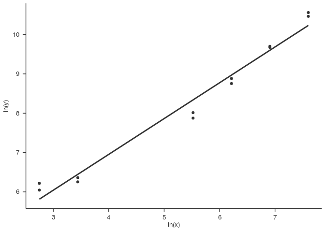
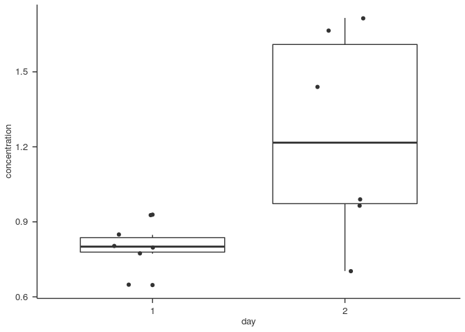

<!-- README.md is generated from README.Rmd. Please edit that file -->
eenv
====

Note
----

`eenv` is somewhat intrusive, it:

-   sets options: `scipen = 18`, `digits = 2`
-   sets your default ggplot2 theme

A package to load packages, functions and variables I frequently use.

Installation
------------

You can install `eenv` from github with:

``` r
# install.packages("devtools")
devtools::install_github("randomchars42/eenv")
```

Loading
-------

``` r
library("eenv")
```

Data import
-----------

### Preparing your raw data

Suppose you have an `ods` / `xls(x)` file with raw values obtained from a measurement like this:

|     |      1|      2|    3|    4|     5|     6|
|-----|------:|------:|----:|----:|-----:|-----:|
| A   |  34997|  38550|  638|  599|   736|   805|
| B   |  16341|  15879|  648|  667|  1335|  1345|
| C   |   7204|   6340|  667|  775|  1276|  1325|
| D   |   3023|   2630|  491|  510|   726|   775|
| E   |    579|    520|  618|  628|  1188|  1060|
| F   |    501|    422|  589|  608|   520|   569|

Save them as `plate_1.csv`- thats like an `ods` / `xls(x)` file but its basically a text file with the values separated by commas (or semicolons for languages that use "," to separate decimals).

In the current versions of LibreOffice / OpenOffice / Microsoft office theres an option "Save as" &gt; "csv".

### Adding names

Before feeding your samples into your measuring device you most likely drafted some sort of plan which position corresponds to which sample (didn't you?). It may have looked like this:

|     | 1    | 2    | 3   | 4   | 5   | 6   |
|-----|:-----|:-----|:----|:----|:----|:----|
| A   | CAL2 | CAL2 | A   | A   | H   | H   |
| B   | CAL3 | CAL3 | B   | B   | I   | I   |
| C   | CAL4 | CAL4 | C   | C   | J   | J   |
| D   | CAL5 | CAL5 | D   | D   | K   | K   |
| E   | CAL8 | CAL8 | E   | E   | L   | L   |
| F   | CAL9 | CAL9 | F   | F   | M   | M   |

So you had some calibrators (CAL1 - CAL4) and samples A, B, C, D, E, F, H, I, J, K, L, M each in duplicates.

To easily set the names for your samples just copy the names into your new `plate_1.csv`:

|     | 1     | 2     | 3   | 4   | 5    | 6    |
|-----|:------|:------|:----|:----|:-----|:-----|
| A   | 34997 | 38550 | 638 | 599 | 736  | 805  |
| B   | 16341 | 15879 | 648 | 667 | 1335 | 1345 |
| C   | 7204  | 6340  | 667 | 775 | 1276 | 1325 |
| D   | 3023  | 2630  | 491 | 510 | 726  | 775  |
| E   | 579   | 520   | 618 | 628 | 1188 | 1060 |
| F   | 501   | 422   | 589 | 608 | 520  | 569  |
| G   | CAL2  | CAL2  | A   | A   | H    | H    |
| H   | CAL3  | CAL3  | B   | B   | I    | I    |
| I   | CAL4  | CAL4  | C   | C   | J    | J    |
| J   | CAL5  | CAL5  | D   | D   | K    | K    |
| K   | CAL8  | CAL8  | E   | E   | L    | L    |
| L   | CAL9  | CAL9  | F   | F   | M    | M    |

Tell `plates_read()` your data contains the names and which column should hold those names by setting `additional_vars = c("name")`.

``` r
# do not run this code yet
plates_read(
  additional_vars = c("name")
)
```

It does not matter which name you select for the column. Pick anything that adequately describes the data in the column.

### Adding more information

Suppose samples A, B, C, D, E, F were taken at day 1 and H, I, J, K, L, M were taken from the same rats / individuals / patients on day 2.

It would be more elegant to encode that into the data:

|     | 1     | 2     | 3    | 4    | 5    | 6    |
|-----|:------|:------|:-----|:-----|:-----|:-----|
| A   | 34997 | 38550 | 638  | 599  | 736  | 805  |
| B   | 16341 | 15879 | 648  | 667  | 1335 | 1345 |
| C   | 7204  | 6340  | 667  | 775  | 1276 | 1325 |
| D   | 3023  | 2630  | 491  | 510  | 726  | 775  |
| E   | 579   | 520   | 618  | 628  | 1188 | 1060 |
| F   | 501   | 422   | 589  | 608  | 520  | 569  |
| G   | CAL2  | CAL2  | A\_1 | A\_1 | A\_2 | A\_2 |
| H   | CAL3  | CAL3  | B\_1 | B\_1 | B\_2 | B\_2 |
| I   | CAL4  | CAL4  | C\_1 | C\_1 | C\_2 | C\_2 |
| J   | CAL5  | CAL5  | D\_1 | D\_1 | D\_2 | D\_2 |
| K   | CAL8  | CAL8  | E\_1 | E\_1 | E\_2 | E\_2 |
| L   | CAL9  | CAL9  | F\_1 | F\_1 | F\_2 | F\_2 |

So now the name and the day are in the same field, separated by `"_"`. (So make sure the original names do not contain `"_"` or there will be trouble.. ;) )

Tell `plates_read()` your data contains the names and day by setting `additional_vars = c("name", "day")`:

``` r
# do not run this code yet
plates_read(
  additional_vars = c("name", "day")
)
```

### Calculating concentrations

So, your measuring device only gave you raw values (extinction rates / relative light units / ...), but you know the concentrations of `CAL1`, `CAL2`, `CAL3` and `CAL4`. To get the concentrations for the rest of the samples you need to tell `plates_read()` which samples are your calibrators and what their actual concentration is.

You do this via `cal_names` and `cal_values`. Both expect a `vector` (that's a series of text strings / numbers / values...). You can create a vector using `c()`. Just put whatever you like in its arguments:

``` r
# try it
like <- c("sunny day", "cake", "coffee", "more coffee", "chocolate", "pizza")
like
#> [1] "sunny day"   "cake"        "coffee"      "more coffee" "chocolate"  
#> [6] "pizza"
```

``` r
# try it
fibonacci <- c(1, 1, 2, 3, 5, 8, 13)
fibonacci
#> [1]  1  1  2  3  5  8 13
```

You already created your first vector when you said: `additional_vars = c("name", "day")` ;) .

So, now create some vectors for your calibrators:

``` r
# try it
calibrator_names = c(
  "CAL1", "CAL2", "CAL3", "CAL4", "CAL5", "CAL6", "CAL7", "CAL8", "CAL9",
  "CAL10"
)

calibrator_values = c(
  4000, 2000, 1000, 500, 250, 125, 62.5, 31.25, 15.625, 7.8125
)
```

Tell `plates_read()` about it:

``` r
# do not run this code yet

calibrator_names = c(
  "CAL1", "CAL2", "CAL3", "CAL4", "CAL5", "CAL6", "CAL7", "CAL8", "CAL9",
  "CAL10"
)

calibrator_values = c(
  4000, 2000, 1000, 500, 250, 125, 62.5, 31.25, 15.625, 7.8125
)

plates_read(
  additional_vars = c("name", "day"),
  cal_names = calibrator_names,
  cal_values = calibrator_values
)
```

The same, but a bit shorter:

``` r
# do not run this code yet
plates_read(
  additional_vars = c("name", "day"),
  cal_names = c(
    "CAL1", "CAL2", "CAL3", "CAL4", "CAL5", "CAL6", "CAL7", "CAL8", "CAL9",
    "CAL10"
  ),
  cal_values = c(
    4000, 2000, 1000, 500, 250, 125, 62.5, 31.25, 15.625, 7.8125
  )
)
```

### Getting the data into the programme

`plates_read()` automagically reads `plate_1.csv` in your current directory. If you have data from more than one plate use `plates = 2` to read `plate1.csv` AND `plate2.csv`. You can read as much plates as you like, as long as their numbers are in a sequence and no numbers are missing.

For now, tell `plates_read()` to read only your first plate:

``` r
# do not run this code yet
plates_read(
  plates = 1,
  additional_vars = c("name", "day"),
  cal_names = c(
    "CAL1", "CAL2", "CAL3", "CAL4", "CAL5", "CAL6", "CAL7", "CAL8", "CAL9",
    "CAL10"
  ),
  cal_values = c(
    4000, 2000, 1000, 500, 250, 125, 62.5, 31.25, 15.625, 7.8125
  )
)
```

You dont have any data yet but want to play a bit?

This saves the example data into `plate_1.csv` (but first it checks if there already is a file with that name, else it would overwrite it):

``` r
# try it
# (don't worry if it looks weird ;) )
if (! file.exists("plate_1.csv")) {
  write_delim(
    x = read_csv(
      file = system.file("extdata", "values_names_properties.csv", package = "eenv"),
      col_names = FALSE),
    path = "plate_1.csv",
    delim = ";",
    col_names = FALSE
  )
}i
```

One thing to note for `.csv`-files: some languages use "." to separate decimals, in those languages `.csv` usually uses "," to separate values. Some European languages use "," for decimals, in these languages ";" is used for separation of values. You need to tell `plates_read()` how you would like to have it with `sep = ","` or `sep = ";"`, respectively:

``` r
# do not run this code yet
plates_read(
  plates = 1,
  sep = ";",
  additional_vars = c("name", "day"),
  cal_names = c(
    "CAL1", "CAL2", "CAL3", "CAL4", "CAL5", "CAL6", "CAL7", "CAL8", "CAL9",
    "CAL10"
  ),
  cal_values = c(
    4000, 2000, 1000, 500, 250, 125, 62.5, 31.25, 15.625, 7.8125
  )
)
```

### Working with the results

`plates_read()` does a lot and wants to tell you about it:

-   reads the data, sorts it, calculates concentrations, calculates how good your duplicates were, ...
-   creates a data table (called `"tibble"` or `"tbl"` for short) with all the values it calculated
-   creates a tibble with only one entry per duplicate (with the mean of the duplicate) which is what you will most likely use
-   creates a graphic to show you how good your calibrators matched the function used to calculate the concentrations

To tell you aout everything it returns a `list`. `list`s are like `vector`s but you can store a lot of different things in them:

``` r
# try it
my_list <- list(a = 1, favourite_food = "pizza", age = 20, a_vector = c(1, 2, 3))
my_list
#> $a
#> [1] 1
#> 
#> $favourite_food
#> [1] "pizza"
#> 
#> $age
#> [1] 20
#> 
#> $a_vector
#> [1] 1 2 3
```

You can access each part of the list in a lot of different ways:

Using "$":

``` r
# try it
my_list$age
#> [1] 20
```

Using the position:

``` r
# try it
my_list[[3]]
#> [1] 20
```

Something totally different:

``` r
# try it
my_list[["a_vector"]]
#> [1] 1 2 3
```

This works for setting values as well:

``` r
# try it
my_list$age <- 30
my_list$age
#> [1] 30
```

Now its time to run `plates_read()`:

``` r
# now you may run it :)
result_list <- plates_read(
  plates = 1,
  sep = ";",
  additional_vars = c("name", "day"),
  cal_names = c(
    "CAL1", "CAL2", "CAL3", "CAL4", "CAL5", "CAL6", "CAL7", "CAL8", "CAL9",
    "CAL10"
  ),
  cal_values = c(
    4000, 2000, 1000, 500, 250, 125, 62.5, 31.25, 15.625, 7.8125
  )
)
```

The resulting list is now stored in `result_list`. In addition, `plates_read()` created two files in your current directory: `data_all.csv` and `data_samples.csv` with all the data ;) .

`plates_read()`'s list holds the following items:

-   `$all`: here you will find all the data , including calibrators, duplicates, ... (saved in `data_all.csv`)
-   `$samples`: only samples here - no calibrators, no duplicates -&gt; most often you will work with this data (saved in `data_samples.csv`)
-   `$plate1`: another list ;)
    -   `$plot`: a plot showing you the linear function used to calculate the concentrations for this plate.

    The points are the calibrators. They should more or less lie close to the line.
    -   `$model`: the model - you won't need this too often ;)
-   (`$plate2`): the same information for every plate you have

Take a look:

``` r
result_list$all
```

|  set| position | sample\_id | name | day |  value|  real|  recovery|    n|    raw|  raw\_mean|  raw\_sd|  raw\_cv|  concentration|  concentration\_sd|  concentration\_cv|
|----:|:---------|:-----------|:-----|:----|------:|-----:|---------:|----:|------:|----------:|--------:|--------:|--------------:|------------------:|------------------:|
|    1| A1       | CAL2       | CAL2 | NA  |  34997|  2000|      1.29|    2|  34997|      36774|   2512.3|     0.07|           2721|             204.08|               0.08|
|    1| B1       | CAL3       | CAL3 | NA  |  16341|  1000|      1.12|    2|  16341|      16110|    326.7|     0.02|           1099|              24.48|               0.02|
|    1| C1       | CAL4       | CAL4 | NA  |   7204|   500|      0.91|    2|   7204|       6772|    610.9|     0.09|            425|              42.04|               0.10|
|    1| D1       | CAL5       | CAL5 | NA  |   3023|   250|      0.70|    2|   3023|       2826|    277.9|     0.10|            163|              17.55|               0.11|
|    1| E1       | CAL8       | CAL8 | NA  |    579|    31|      0.91|    2|    579|        550|     41.7|     0.08|             27|               2.24|               0.08|
|    1| F1       | CAL9       | CAL9 | NA  |    501|    16|      1.56|    2|    501|        462|     55.9|     0.12|             22|               2.95|               0.13|
|    1| A2       | CAL2       | CAL2 | NA  |  38550|  2000|      1.43|    2|  38550|      36774|   2512.3|     0.07|           2721|             204.08|               0.08|
|    1| B2       | CAL3       | CAL3 | NA  |  15879|  1000|      1.08|    2|  15879|      16110|    326.7|     0.02|           1099|              24.48|               0.02|
|    1| C2       | CAL4       | CAL4 | NA  |   6340|   500|      0.79|    2|   6340|       6772|    610.9|     0.09|            425|              42.04|               0.10|
|    1| D2       | CAL5       | CAL5 | NA  |   2630|   250|      0.60|    2|   2630|       2826|    277.9|     0.10|            163|              17.55|               0.11|
|    1| E2       | CAL8       | CAL8 | NA  |    520|    31|      0.81|    2|    520|        550|     41.7|     0.08|             27|               2.24|               0.08|
|    1| F2       | CAL9       | CAL9 | NA  |    422|    16|      1.29|    2|    422|        462|     55.9|     0.12|             22|               2.95|               0.13|
|    1| A3       | A\_1       | A    | 1   |    638|    NA|        NA|    2|    638|        618|     27.6|     0.04|             31|               1.50|               0.05|
|    1| B3       | B\_1       | B    | 1   |    648|    NA|        NA|    2|    648|        658|     13.4|     0.02|             33|               0.74|               0.02|
|    1| C3       | C\_1       | C    | 1   |    667|    NA|        NA|    2|    667|        721|     76.4|     0.11|             36|               4.22|               0.12|
|    1| D3       | D\_1       | D    | 1   |    491|    NA|        NA|    2|    491|        500|     13.4|     0.03|             24|               0.72|               0.03|
|    1| E3       | E\_1       | E    | 1   |    618|    NA|        NA|    2|    618|        623|      7.1|     0.01|             31|               0.39|               0.01|
|    1| F3       | F\_1       | F    | 1   |    589|    NA|        NA|    2|    589|        598|     13.4|     0.02|             30|               0.73|               0.02|
|    1| A4       | A\_1       | A    | 1   |    599|    NA|        NA|    2|    599|        618|     27.6|     0.04|             31|               1.50|               0.05|
|    1| B4       | B\_1       | B    | 1   |    667|    NA|        NA|    2|    667|        658|     13.4|     0.02|             33|               0.74|               0.02|
|    1| C4       | C\_1       | C    | 1   |    775|    NA|        NA|    2|    775|        721|     76.4|     0.11|             36|               4.22|               0.12|
|    1| D4       | D\_1       | D    | 1   |    510|    NA|        NA|    2|    510|        500|     13.4|     0.03|             24|               0.72|               0.03|
|    1| E4       | E\_1       | E    | 1   |    628|    NA|        NA|    2|    628|        623|      7.1|     0.01|             31|               0.39|               0.01|
|    1| F4       | F\_1       | F    | 1   |    608|    NA|        NA|    2|    608|        598|     13.4|     0.02|             30|               0.73|               0.02|
|    1| A5       | A\_2       | A    | 2   |    736|    NA|        NA|    2|    736|        770|     48.8|     0.06|             39|               2.71|               0.07|
|    1| B5       | B\_2       | B    | 2   |   1335|    NA|        NA|    2|   1335|       1340|      7.1|     0.01|             72|               0.42|               0.01|
|    1| C5       | C\_2       | C    | 2   |   1276|    NA|        NA|    2|   1276|       1300|     34.6|     0.03|             69|               2.03|               0.03|
|    1| D5       | D\_2       | D    | 2   |    726|    NA|        NA|    2|    726|        750|     34.6|     0.05|             38|               1.92|               0.05|
|    1| E5       | E\_2       | E    | 2   |   1188|    NA|        NA|    2|   1188|       1124|     90.5|     0.08|             59|               5.22|               0.09|
|    1| F5       | F\_2       | F    | 2   |    520|    NA|        NA|    2|    520|        544|     34.6|     0.06|             27|               1.86|               0.07|
|    1| A6       | A\_2       | A    | 2   |    805|    NA|        NA|    2|    805|        770|     48.8|     0.06|             39|               2.71|               0.07|
|    1| B6       | B\_2       | B    | 2   |   1345|    NA|        NA|    2|   1345|       1340|      7.1|     0.01|             72|               0.42|               0.01|
|    1| C6       | C\_2       | C    | 2   |   1325|    NA|        NA|    2|   1325|       1300|     34.6|     0.03|             69|               2.03|               0.03|
|    1| D6       | D\_2       | D    | 2   |    775|    NA|        NA|    2|    775|        750|     34.6|     0.05|             38|               1.92|               0.05|
|    1| E6       | E\_2       | E    | 2   |   1060|    NA|        NA|    2|   1060|       1124|     90.5|     0.08|             59|               5.22|               0.09|
|    1| F6       | F\_2       | F    | 2   |    569|    NA|        NA|    2|    569|        544|     34.6|     0.06|             27|               1.86|               0.07|

``` r
result_list$samples
```

| position | sample\_id | name | day |  plate|    n|   raw|  raw\_sd|  raw\_cv|  concentration|  concentration\_sd|  concentration\_cv|
|:---------|:-----------|:-----|:----|------:|----:|-----:|--------:|--------:|--------------:|------------------:|------------------:|
| A3       | A\_1       | A    | 1   |      1|    2|   618|     27.6|     0.04|             31|               1.50|               0.05|
| B3       | B\_1       | B    | 1   |      1|    2|   658|     13.4|     0.02|             33|               0.74|               0.02|
| C3       | C\_1       | C    | 1   |      1|    2|   721|     76.4|     0.11|             36|               4.22|               0.12|
| D3       | D\_1       | D    | 1   |      1|    2|   500|     13.4|     0.03|             24|               0.72|               0.03|
| E3       | E\_1       | E    | 1   |      1|    2|   623|      7.1|     0.01|             31|               0.39|               0.01|
| F3       | F\_1       | F    | 1   |      1|    2|   598|     13.4|     0.02|             30|               0.73|               0.02|
| A5       | A\_2       | A    | 2   |      1|    2|   770|     48.8|     0.06|             39|               2.71|               0.07|
| B5       | B\_2       | B    | 2   |      1|    2|  1340|      7.1|     0.01|             72|               0.42|               0.01|
| C5       | C\_2       | C    | 2   |      1|    2|  1300|     34.6|     0.03|             69|               2.03|               0.03|
| D5       | D\_2       | D    | 2   |      1|    2|   750|     34.6|     0.05|             38|               1.92|               0.05|
| E5       | E\_2       | E    | 2   |      1|    2|  1124|     90.5|     0.08|             59|               5.22|               0.09|
| F5       | F\_2       | F    | 2   |      1|    2|   544|     34.6|     0.06|             27|               1.86|               0.07|

``` r
result_list$plate1$plot
#> Warning: Removed 24 rows containing non-finite values (stat_smooth).
#> Warning: Removed 24 rows containing missing values (geom_point).
```



### If the calibrators aren't so good...

The lowest calibrator ("CAL9") does not seem to fit to well. So perhaps you get a better result when removing it? You can do that by setting `exclude_cals =  list(plate1 = c("CAL9"))`.

(But obviously, you won't be able to interpret values below "CAL8", other than that they are "below CAL8"!).

``` r
# now you may run it :)
result_list <- plates_read(
  plates = 1,
  sep = ";",
  additional_vars = c("name", "day"),
  cal_names = c(
    "CAL1", "CAL2", "CAL3", "CAL4", "CAL5", "CAL6", "CAL7", "CAL8", "CAL9",
    "CAL10"
  ),
  cal_values = c(
    4000, 2000, 1000, 500, 250, 125, 62.5, 31.25, 15.625, 7.8125
  ),
  exclude_cals =  list(plate1 = c("CAL9"))
)
```

Take a look at the fit of the line:

``` r
# try it
result_list$plate1$plot
#> Warning: Removed 26 rows containing non-finite values (stat_smooth).
#> Warning: Removed 26 rows containing missing values (geom_point).
```


Better! But be careful when interpreting values below "CAL8" (the lowest use calibrator now).

Where to go to from here
------------------------

First of all, to save a couple of keystrokes and make remembering easier:

``` r
# try it
my_data <- result_list$samples
```

Then we need some tools:

``` r
library("tidyverse")
library("bioset")
```

You could take a look which duplicates have a high (&gt; 20 %) coefficient of variation:

``` r
# try it
my_data %>%
  filter(concentration_cv > 0.20)
#> # A tibble: 0 x 12
#> # ... with 12 variables: position <chr>, sample_id <chr>, name <chr>,
#> #   day <chr>, plate <int>, n <int>, raw <dbl>, raw_sd <dbl>,
#> #   raw_cv <dbl>, concentration <dbl>, concentration_sd <dbl>,
#> #   concentration_cv <dbl>
```

Luckily, there are no samples. Note that the result was not stored.

If there were you could exclude them like:

``` r
# try it
my_data <- my_data %>%
  filter(concentration_cv < 0.20)
my_data
```

| position | sample\_id | name | day |  plate|    n|   raw|  raw\_sd|  raw\_cv|  concentration|  concentration\_sd|  concentration\_cv|
|:---------|:-----------|:-----|:----|------:|----:|-----:|--------:|--------:|--------------:|------------------:|------------------:|
| A3       | A\_1       | A    | 1   |      1|    2|   618|     27.6|     0.04|             42|               1.85|               0.04|
| B3       | B\_1       | B    | 1   |      1|    2|   658|     13.4|     0.02|             44|               0.90|               0.02|
| C3       | C\_1       | C    | 1   |      1|    2|   721|     76.4|     0.11|             49|               5.10|               0.10|
| D3       | D\_1       | D    | 1   |      1|    2|   500|     13.4|     0.03|             34|               0.90|               0.03|
| E3       | E\_1       | E    | 1   |      1|    2|   623|      7.1|     0.01|             42|               0.47|               0.01|
| F3       | F\_1       | F    | 1   |      1|    2|   598|     13.4|     0.02|             40|               0.90|               0.02|
| A5       | A\_2       | A    | 2   |      1|    2|   770|     48.8|     0.06|             52|               3.26|               0.06|
| B5       | B\_2       | B    | 2   |      1|    2|  1340|      7.1|     0.01|             90|               0.47|               0.01|
| C5       | C\_2       | C    | 2   |      1|    2|  1300|     34.6|     0.03|             87|               2.30|               0.03|
| D5       | D\_2       | D    | 2   |      1|    2|   750|     34.6|     0.05|             51|               2.31|               0.05|
| E5       | E\_2       | E    | 2   |      1|    2|  1124|     90.5|     0.08|             76|               6.02|               0.08|
| F5       | F\_2       | F    | 2   |      1|    2|   544|     34.6|     0.06|             37|               2.32|               0.06|

This time the result was stored. Be careful when overwriting data. You can always go back and run `plates_read()` again :).

Now, given the concentration of your calibrators was in "ng / ml" but your editor wants you to use SI units you could convert the concentrations like this:

``` r
# try it
my_data <- my_data %>%
  mutate(
    concentration = convert_conc(x = concentration, from = "ng / ml", to = "nmol / l", molar_mass = 52391)
  )
my_data
```

| position | sample\_id | name | day |  plate|    n|   raw|  raw\_sd|  raw\_cv|  concentration|  concentration\_sd|  concentration\_cv|
|:---------|:-----------|:-----|:----|------:|----:|-----:|--------:|--------:|--------------:|------------------:|------------------:|
| A3       | A\_1       | A    | 1   |      1|    2|   618|     27.6|     0.04|           0.80|               1.85|               0.04|
| B3       | B\_1       | B    | 1   |      1|    2|   658|     13.4|     0.02|           0.85|               0.90|               0.02|
| C3       | C\_1       | C    | 1   |      1|    2|   721|     76.4|     0.11|           0.93|               5.10|               0.10|
| D3       | D\_1       | D    | 1   |      1|    2|   500|     13.4|     0.03|           0.65|               0.90|               0.03|
| E3       | E\_1       | E    | 1   |      1|    2|   623|      7.1|     0.01|           0.80|               0.47|               0.01|
| F3       | F\_1       | F    | 1   |      1|    2|   598|     13.4|     0.02|           0.77|               0.90|               0.02|
| A5       | A\_2       | A    | 2   |      1|    2|   770|     48.8|     0.06|           0.99|               3.26|               0.06|
| B5       | B\_2       | B    | 2   |      1|    2|  1340|      7.1|     0.01|           1.72|               0.47|               0.01|
| C5       | C\_2       | C    | 2   |      1|    2|  1300|     34.6|     0.03|           1.67|               2.30|               0.03|
| D5       | D\_2       | D    | 2   |      1|    2|   750|     34.6|     0.05|           0.97|               2.31|               0.05|
| E5       | E\_2       | E    | 2   |      1|    2|  1124|     90.5|     0.08|           1.44|               6.02|               0.08|
| F5       | F\_2       | F    | 2   |      1|    2|   544|     34.6|     0.06|           0.70|               2.32|               0.06|

Or you could create a plot like this:

``` r
# try it
# use our data
# use column "name" as x-axis
# use column "concentration" as y-axis
ggplot(data = my_data, aes(x = name, y = concentration, colour = name)) +
  # plot each value as a point
  geom_point() +
  # draw a sub-plot (facet) for each day
  facet_wrap(~day)
```


Or a boxplot:

``` r
# try it
# use our data
# use column "name" as x-axis
# use column "concentration" as y-axis
ggplot(data = my_data, aes(x = day, y = concentration)) +
  # draw boxplots
  geom_boxplot() +
  # draw each value as a point over the boxplot
  geom_jitter(width = 0.2)
```



``` r
  # you could try
  # geom_point() as well ;)
```

Where to get help
-----------------

**The INTERNET** ;)

To learn more about working with data:

-   **`dplyr`**, good documentation with many examples : <http://dplyr.tidyverse.org/>
-   **R for Data Science**, by the author of `dplyr` and `ggplot`: <http://r4ds.had.co.nz/>
-   **good packages**: <http://tidyverse.org/>

To learn more about presenting data in plots:

-   **Visualising data**: <http://r4ds.had.co.nz/data-visualisation.html>
-   **Communicating results with plots**: <http://r4ds.had.co.nz/graphics-for-communication.html>
-   **good examples**: <http://www.cookbook-r.com/Graphs/>

Rarely needed
-------------

### Calibrators do not need to be ln-ln transformed

Your calibrators are linear? You can use: `model_func = fit_linear` and `interpolate_func = interpolate_linear`. Basicallly, you can use any function as `model_function` that returns a model which is understood by your `interpolate_func`.

``` r
# try it but the result wont be as good
result_list <- plates_read(
  plates = 1,
  sep = ";",
  additional_vars = c("name", "day"),
  cal_names = c(
    "CAL1", "CAL2", "CAL3", "CAL4", "CAL5", "CAL6", "CAL7", "CAL8", "CAL9",
    "CAL10"
  ),
  cal_values = c(
    4000, 2000, 1000, 500, 250, 125, 62.5, 31.25, 15.625, 7.8125
  ),
  exclude_cals =  list(plate1 = c("CAL9")),
  model_func = fit_linear,
  interpolate_func = interpolate_linear
)

result_list$plate1$plot
```

### Data sets are stored somewhere else

Your files are stored somewhere else? Just set `path = path/to/your/files` as a parameter for `plates_read()`.
